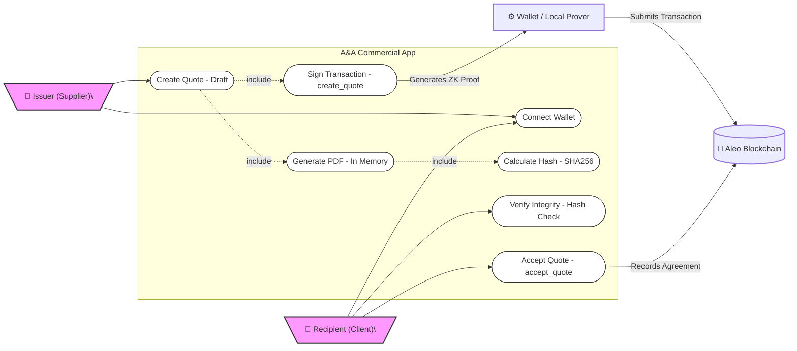
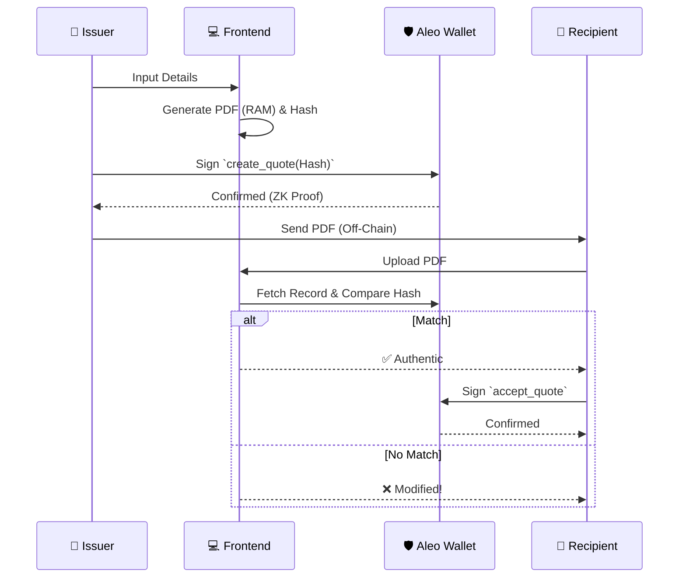

# UML Diagrams - A&A Commercial

This document contains the Use Case and Activity diagrams for the A&A Commercial application.

## 1. Use Case Diagram

This diagram illustrates the interactions between the actors (Issuer, Recipient, System) and the application's main functionalities.

---

## 2. Sequence Diagram (Activity Flow)

This diagram details the complete flow of interactions, from quote creation to acceptance.

