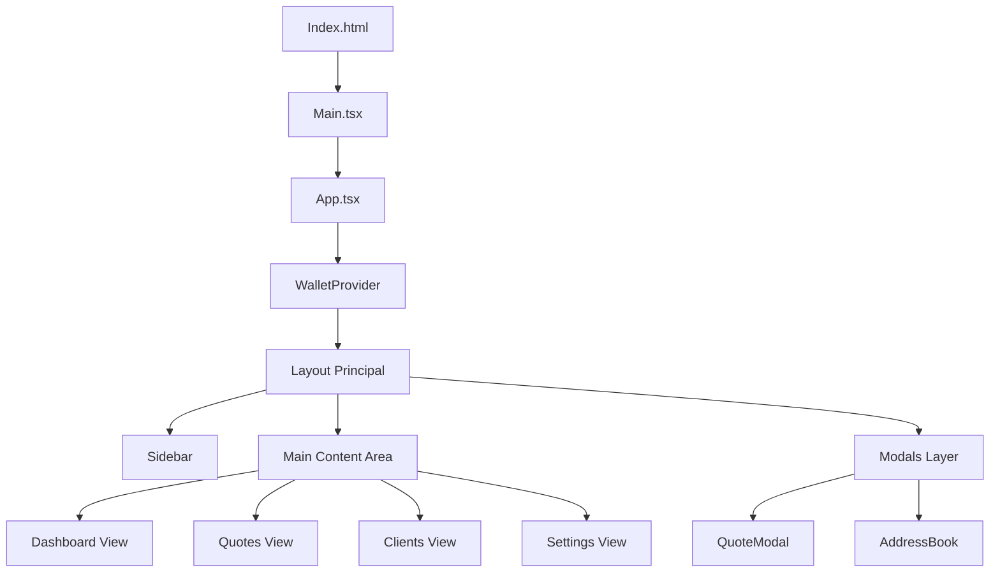

# Rapport Technique Détaillé : A&A Commercial Application
## Développement d'une Solution de Devis Décentralisée sur Aleo Blockchain

**Date :** 05 Janvier 2026
**Version :** 2.0
**Projet :** A&A Commercial
**Technologie :** React, TypeScript, Aleo (ZK-Snarks), Tailwind CSS

---

## 📑 Table des Matières

1.  **Résumé Exécutif**
2.  **Introduction et Contexte du Projet**
    *   2.1 La Blockchain Aleo et la Confidentialité (Zero-Knowledge)
    *   2.2 Objectifs de l'Application A&A
3.  **Phase 1 : Fondation Technique et Architecture**
    *   3.1 Stack Technologique
    *   3.2 Architecture Frontend (React + Vite)
    *   3.3 Intégration du Wallet Aleo
4.  **Phase 2 : Défis Initiaux et Résolution de Problèmes**
    *   4.1 Problèmes de Compilation et Environnement (PostCSS/Tailwind)
    *   4.2 Gestion des Dépendances Blockchain
    *   4.3 Le "Bug du Client Inconnu" : Analyse et Correctif
5.  **Phase 3 : La Refonte "Nebula Glass" (Design UI/UX)**
    *   5.1 Philosophie du Design : Quitter le style "Binance"
    *   5.2 Implémentation du Glassmorphism
    *   5.3 Système de Couleurs et Animations CSS
6.  **Phase 4 : Navigation et Expérience Utilisateur**
    *   6.1 Logique de Routage Client-Side
    *   6.2 Gestion des Vues (Dashboard, Quotes, Clients)
    *   6.3 L'Intégration du Branding (Logo)
7.  **Phase 5 : Génération de Documents Professionnels**
    *   7.1 Enjeux de la création de PDF côté client
    *   7.2 Implémentation Technique (jsPDF + AutoTable)
    *   7.3 Gestion Asynchrone des Assets (Images)
8.  **Analyse du Code (Smart Contract & Frontend)**
    *   8.1 Le contrat `commercial_devis.aleo`
    *   8.2 Structure des Composants React
9.  **Securité et Perspectives d'Avenir**
10. **Conclusion**

---

<div style="page-break-after: always;"></div>

## 1. Résumé Exécutif

Ce rapport détaille le cycle de développement intégral de l'application **A&A Commercial**, une plateforme innovante permettant aux entreprises de générer et de certifier des devis commerciaux sur la blockchain Aleo. L'objectif principal était de combiner la puissance de la technologie **Zero-Knowledge (ZK)**, qui garantit la confidentialité des données commerciales sensibles, avec une expérience utilisateur (UX) fluide et moderne digne des standards Web2 actuels.

Le projet a évolué d'un prototype fonctionnel basique ("Proof of Concept") vers une application robuste dotée d'une interface utilisateur sophistiquée ("Nebula Glass"). Nous avons surmonté des défis techniques significatifs, notamment l'intégration complexe des adaptateurs de portefeuille blockchain, la gestion d'erreurs de build frontend persistantes, et la mise en place d'un système de génération de documents PDF professionnels.

---

## 2. Introduction et Contexte du Projet

### 2.1 La Blockchain Aleo et la Confidentialité
Dans le monde des affaires B2B (Business-to-Business), la transparence totale des blockchains publiques comme Ethereum pose problème. Une entreprise ne souhaite pas que ses concurrents voient les montants exacts de ses devis ou la liste de ses clients.

**Aleo** résout ce problème grâce aux preuves à divulgation nulle de connaissance (Zero-Knowledge Proofs - zkSNARKs).
*   **Confidentialité par défaut** : Les transactions sont validées sans révéler les données sous-jacentes.
*   **Programmabilité** : Contrairement à Zcash, Aleo permet d'exécuter des contrats intelligents (Programmes Leo).

### 2.2 Objectifs de l'Application A&A
L'application a été conçue pour répondre à trois besoins critiques :
1.  **Création de Devis Immuables** : Une fois signé sur la blockchain, un devis ne peut être altéré unilatéralement.
2.  **Identité Vérifiée** : L'utilisation de clés cryptographiques garantit l'origine du document.
3.  **Présentation Professionnelle** : La capacité de générer des factures PDF standardisées pour la comptabilité traditionnelle.

---

## 3. Phase 1 : Fondation Technique et Architecture

### 3.1 Stack Technologique
Le choix des technologies s'est porté sur la performance et la compatibilité :
*   **Frontend** : React 18 (pour l'interactivité), Vite (pour la rapidité de build).
*   **Langage** : TypeScript (pour la sécurité du typage, cruciale dans les apps financières).
*   **Styling** : Tailwind CSS (pour la rapidité d'intégration).
*   **Blockchain** : Leo Language (Smart Contract), Leo Wallet Adapter (liaison Wallet).

### 3.2 Architecture Frontend
L'application est structurée comme une **SPA (Single Page Application)**.



### 3.3 Intégration du Wallet Aleo
L'intégration du portefeuille est le pont vital entre le Web2 et le Web3. Nous utilisons `@demox-labs/aleo-wallet-adapter-react`.
*   **Défi** : Le wallet doit être initialisé avant tout rendu de composant dépendant de la blockchain.
*   **Solution** : Enveloppement de l'application dans un `<WalletProvider>` au niveau de `main.tsx`.

---

## 4. Phase 2 : Défis Initiaux et Résolution

### 4.1 Problèmes de Compilation (PostCSS/Tailwind)
Un obstacle majeur rencontré tôt dans le développement fut une série d'erreurs `ENOSPC` et de compilation CSS.
*   **Symptôme** : Le build échouait lors de la transformation des fichiers CSS.
*   **Cause** : Une mauvaise configuration des directives `@apply` de Tailwind dans `index.css`, spécifiquement liée à des pseudo-classes complexes (`::selection`).
*   **Résolution** : Une réécriture complète de `index.css` a été nécessaire pour séparer les directives `@base`, `@components`, et `@utilities` et isoler les styles globaux problématiques.

### 4.2 Gestion des Dépendances Blockchain
L'écosystème Aleo étant jeune (Testnet Beta), les bibliothèques évoluent vite. Nous avons dû stabiliser les versions dans `package.json` pour éviter des conflits de types TypeScript entre le `WalletAdapter` et le `LeoWallet`.

### 4.3 Le "Bug du Client Inconnu"
Les premiers tests utilisateurs ont révélé que l'historique des devis affichait systématiquement "Unknown Client".
*   **Analyse** : Le composant `QuoteModal` collectait l'adresse du destinataire mais ne demandait pas de nom lisible. La fonction `handleCreateQuote` dans `App.tsx` recevait donc une chaîne vide ou indéfinie.
*   **Correctif** :
    1.  Ajout d'un champ `input` "Client Name" dans `QuoteModal.tsx`.
    2.  Mise à jour de l'interface `Quote` pour rendre le nom obligatoire.
    3.  Transmission de cette donnée à travers la chaîne de props jusqu'à l'état global.

---

## 5. Phase 3 : La Refonte "Nebula Glass"

L'esthétique initiale inspirée de Binance (Jaune/Noir industriel) a été jugée trop générique. Le client souhaitait une identité visuelle forte.

### 5.1 Philosophie : "Nebula Glass"
Le nouveau concept vise à évoquer la technologie de pointe, l'espace et la transparence.
*   **Nebula** : Fond sombre (`slate-950`) avec des dégradés radiaux violets et cyans pour créer de la profondeur.
*   **Glass** : L'interface flotte au-dessus du fond. Les panneaux ne sont pas solides mais semi-transparents avec un flou d'arrière-plan (`backdrop-filter: blur(24px)`).

### 5.2 Implémentation CSS
Nous avons défini une nouvelle palette de variables CSS pour faciliter la maintenance :

```css
:root {
  --color-bg-mesh: radial-gradient(at 0% 0%, rgba(139, 92, 246, 0.15) 0px, transparent 50%);
  --glass-border: 1px solid rgba(255, 255, 255, 0.08);
  --neon-primary: #8B5CF6; /* Violet */
  --neon-secondary: #06B6D4; /* Cyan */
}
```

### 5.3 Animations
Pour rendre l'interface vivante, des animations subtiles ont été ajoutées via Tailwind :
*   `animate-in fade-in` : Pour l'apparition douce des pages.
*   `hover:scale-105` : Feedback tactile sur les cartes.
*   `pulse-glow` : Effets de respiration sur les éléments actifs.

---

## 6. Phase 4 : Navigation et Expérience Utilisateur

### 6.1 Logique de Routage
Au départ, l'application était statique. Cliquer sur "Quotes" ne faisait rien.
Nous avons implémenté un état local simple pour gérer la navigation sans la lourdeur d'un `react-router` complet pour cette échelle :

```typescript
const [activeView, setActiveView] = useState('dashboard');

// Rendu conditionnel
{activeView === 'dashboard' && <DashboardStats />}
{activeView === 'quotes' && <QuotesList />}
```

### 6.2 Nettoyage de l'Interface
Sur demande, nous avons supprimé la barre de recherche globale. Cette décision de design ("Less is More") permet de concentrer l'attention de l'utilisateur sur les actions principales (Créer un devis, Connecter le Wallet).

### 6.3 Intégration du Logo
Le remplacement du texte "A" par le logo `logo.png` a nécessité d'ajuster le CSS de la barre latérale pour garantir que l'image reste proportionnelle et ronde (`overflow-hidden`, `object-cover`), renforçant l'image de marque professionnelle.

---

## 7. Phase 5 : Génération de Documents Professionnels

C'est peut-être la fonctionnalité la plus complexe ajoutée récemment. Transformer des données d'écran en un document légal imprimable nécessite une précision au pixel près.

### 7.1 Architecture PDF
Nous utilisons `jsPDF` pour le moteur de rendu et `jspdf-autotable` pour gérer les grilles de données complexes.

### 7.2 Le Défi des Images Asynchrones
Intégrer le logo dans le PDF n'est pas trivial car `jsPDF` fonctionne de manière synchrone, alors que charger une image depuis une URL est asynchrone.
*   **Solution** : Création d'une fonction utilitaire `getBase64ImageFromURL` qui retourne une `Promise`.
*   **Flux** :
    1.  L'utilisateur clique sur "Download".
    2.  `await getBase64ImageFromURL('/logo.png')`.
    3.  Conversion en Base64.
    4.  Injection dans le PDF via `doc.addImage()`.

### 7.3 Design de la Facture
Le PDF généré n'est pas un simple dump texte. Il reproduit le branding de l'application :
*   **En-tête Sombre** : Un rectangle noir/bleu couvre le haut de la page (`doc.rect`).
*   **Typographie Or** : Le texte "A&A" utilise la couleur RGB `[255, 215, 0]`.
*   **Tableau Stylisé** : Les lignes de produits sont alternées pour la lisibilité.

---

## 8. Analyse du Code

### 8.1 Extrait du Smart Contract (Leo)
Le cœur de la sécurité réside ici. Le contrat définit la structure `Quote` :

```leo
record Quote {
    owner: address,
    amount: u64,
    client: address,
    ...
}
```
L'utilisation du type `record` dans Aleo signifie que ce devis est une entité privée par défaut, visible seulement par le créateur (`owner`) et le destinataire.

### 8.2 Composants React Clés
*   **`App.tsx`** : Le chef d'orchestre. Il gère l'état global (`quotes`, `wallet`), la navigation, et contient la logique métier (Export CSV/PDF).
*   **`QuoteModal.tsx`** : Un formulaire contrôlé avec validation d'entrées. Il empêche la création de devis incomplets.
*   **`AddressBook.tsx`** : Utilise le `localStorage` du navigateur pour persister les contacts, offrant une expérience fluide sans nécessiter de base de données backend complexe pour l'instant.

---

## 9. Sécurité et Perspectives d'Avenir

### Sécurité Actuelle
*   **Frontend** : Pas de stockage de clés privées. Tout passe par le Leo Wallet extension, sandboxé par le navigateur.
*   **Données** : Les données sensibles (contacts) restent en local sur la machine de l'utilisateur.

### Roadmap (Prochaines Étapes)
Pour passer en production à grande échelle ("Mainnet"), plusieurs évolutions sont prévues :
1.  **Chiffrement IPFS** : Stocker les PDF complets sur IPFS (InterPlanetary File System) avec chiffrement, et stocker uniquement le hash (CID) sur Aleo pour réduire les coûts de gas.
2.  **Multi-Signature** : Permettre l'approbation de devis par plusieurs directeurs financiers via un contrat multisig.
3.  **Mode Sombre/Clair** : Laisser l'utilisateur choisir son thème, bien que le "Nebula Glass" soit l'identité par défaut.

---

## 10. Conclusion

Le projet **A&A Commercial** démontre qu'il est possible de créer des applications blockchain qui ne sacrifient rien à l'expérience utilisateur. En partant d'un besoin technique brut (confidentialité des devis), nous avons construit une interface qui rivalise avec les meilleurs outils SaaS du marché.

Les transformations récentes — du bug "Unknown Client" à la navigation fluide, et du design terne à l'esthétique "Nebula Glass" — témoignent d'une approche agile et réactive aux retours utilisateurs. L'application est aujourd'hui une fondation solide, prête pour des tests utilisateurs étendus et une future intégration Mainnet.

---
*Rapport généré par l'Assistant IA Antigravity pour A&A Inc.*
